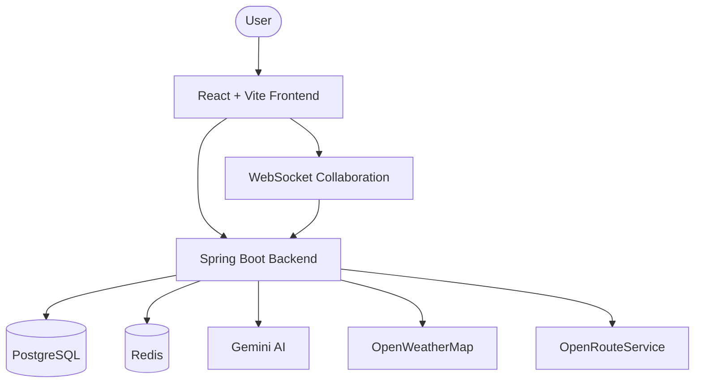

# Travel Planner

Travel Planner is an AI-assisted travel planning application built with a modular monolith architecture on Spring Boot 3 and a modern React frontend. The system combines itinerary generation, route optimization, weather-aware recommendations, real-time collaboration, and budget tracking in a single cohesive platform.

## Key capabilities

- AI-powered itinerary generation using Gemini
- Weather-aware recommendations based on OpenWeatherMap data
- Smart destination matching through vector search and collaborative filtering
- Real-time collaboration for shared trip planning
- Budget tracking and export to PDF / ICS
- Booking abstraction for future provider integration

## Architecture at a glance

The backend follows a modular monolith pattern with clearly separated business domains:

- user
- itinerary
- budget
- collaboration
- booking
- interaction

This structure keeps the system easy to evolve while preserving a clean boundary between responsibilities.

## System architecture

### Runtime view



## Repository structure

```text
travel-planner/
├── frontend/                  # React frontend
├── src/main/java/             # Spring Boot backend
├── src/main/resources/        # Configuration, SQL, mock data
├── docs/                      # Architecture docs and ADRs
│   ├── adr/                   # Architecture Decision Records
│   ├── architecture-overview.md
│   ├── system-context-diagram.md
│   └── c4-model.md
└── docker-compose.yml         # Local infrastructure for PostgreSQL and Redis
```

## Architecture documentation

The project includes a structured set of architecture documents:

- [docs/architecture-overview.md](docs/architecture-overview.md) — high-level overview of the solution
- [docs/system-context-diagram.md](docs/system-context-diagram.md) — system context and external interactions
- [docs/c4-model.md](docs/c4-model.md) — C4-based architecture model
- [docs/adr/README.md](docs/adr/README.md) — architecture decision log

## Technology stack

### Frontend
- React
- Vite
- TypeScript
- React Router
- Leaflet for maps

### Backend
- Spring Boot 3
- Spring Security
- Spring Data JPA
- WebSocket / STOMP
- OpenAPI / Swagger

### Data and infrastructure
- PostgreSQL with pgvector
- Redis for cache and rate limiting
- Docker Compose for local environments

## Security and operations

The system is designed with production-readiness in mind:

- JWT-based authentication with refresh-token support
- Spring Security for access control
- Rate limiting using Bucket4j
- Logging, monitoring, and observability strategy
- CI/CD automation and backup/disaster recovery planning

## Getting started

### Prerequisites
- Java 17
- Node.js and npm
- Docker

### 1. Start infrastructure
```bash
docker-compose up -d
```

### 2. Configure environment variables
Update the application configuration with your API keys, for example:

```yaml
gemini.api.key: "YOUR_GEMINI_API_KEY"
ors.api.key: "YOUR_ORS_API_KEY"
openweathermap.api.key: "YOUR_OWM_API_KEY"
```

### 3. Start backend
```bash
./mvnw spring-boot:run
```

### 4. Start frontend
```bash
cd frontend
npm install
npm run dev
```

## Design principles

- Keep business domains clearly separated
- Favor maintainability over premature complexity
- Use documented architectural decisions to guide change
- Prepare the system for gradual evolution toward additional services if needed

## Future direction

The current architecture is well-suited for an MVP and early growth phase. As the product expands, the system can evolve through:

1. gradual modularization of business capabilities,
2. introduction of an API gateway,
3. selective extraction of services,
4. support for multi-tenancy in enterprise scenarios.
