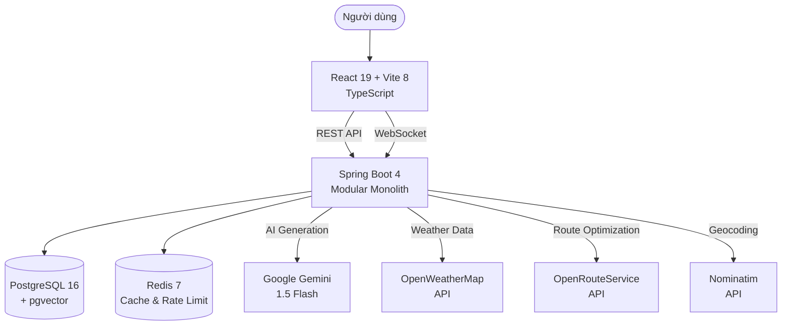

# 🌍 Travel Planner

> Ứng dụng lên kế hoạch du lịch thông minh, tích hợp AI — được xây dựng trên kiến trúc Modular Monolith với Spring Boot 4 và React 19.

Travel Planner kết hợp khả năng sinh lịch trình bằng Gemini AI, gợi ý điểm đến thông minh (vector search + collaborative filtering), dự báo thời tiết, tối ưu tuyến đường, cộng tác realtime, và quản lý ngân sách — tất cả trong một nền tảng duy nhất.

---

## ✨ Tính năng chính

| Tính năng | Mô tả |
|---|---|
| 🤖 **Sinh lịch trình AI** | Sử dụng Gemini 1.5 Flash để tạo lịch trình 3 ngày chi tiết, có nhận biết thời tiết (weather-aware RAG) |
| 🔍 **Gợi ý điểm đến thông minh** | Kết hợp vector search (pgvector + sentence-transformers) với Bayesian rating và hard filter theo ngân sách/tháng |
| 👥 **Collaborative Filtering** | Gợi ý điểm đến dựa trên hành vi của người dùng tương tự |
| 🌦️ **Dự báo thời tiết** | Tích hợp OpenWeatherMap — tự động ưu tiên hoạt động trong nhà khi có mưa |
| 🗺️ **Tối ưu tuyến đường** | Sử dụng OpenRouteService cho route optimization và Nominatim cho geocoding |
| 🔄 **Adaptive Replanning** | Tự động điều chỉnh lịch trình khi có sự kiện bất ngờ (delay, thay đổi thời tiết) |
| 💬 **Cộng tác realtime** | WebSocket/STOMP cho phép nhiều người cùng chỉnh sửa lịch trình |
| 💰 **Quản lý ngân sách** | Theo dõi chi tiêu theo danh mục, tổng hợp báo cáo |
| 📄 **Xuất PDF / ICS** | Xuất lịch trình sang file PDF hoặc calendar (.ics) |
| 🏨 **Booking abstraction** | Provider pattern sẵn sàng tích hợp các nhà cung cấp đặt phòng/vé |
| 🔐 **Xác thực JWT** | Đăng ký, đăng nhập với mã hóa BCrypt và JWT stateless |
| ⚡ **Rate Limiting** | Giới hạn request bằng Bucket4j (mặc định 5 req/phút) |

---

## 🏗️ Kiến trúc hệ thống

### Tổng quan


```mermaid
graph TD
    User([Người dùng]) --> Frontend["React 19 + Vite 8<br/>TypeScript"]
    Frontend -->|REST API| Backend["Spring Boot 4<br/>Modular Monolith"]
    Frontend -->|WebSocket| Backend
    Backend --> PostgreSQL[("PostgreSQL 16<br/>+ pgvector")]
    Backend --> Redis[("Redis 7<br/>Cache & Rate Limit")]
    Backend -->|AI Generation| Gemini["Google Gemini<br/>1.5 Flash"]
    Backend -->|Weather Data| OWM["OpenWeatherMap<br/>API"]
    Backend -->|Route Optimization| ORS["OpenRouteService<br/>API"]
    Backend -->|Geocoding| Nominatim["Nominatim<br/>API"]
```

### Modular Monolith — Business Domains

Hệ thống backend được tổ chức thành **7 module nghiệp vụ** độc lập, mỗi module có cấu trúc layered riêng (`controller → service → repository → domain`):

```
com.travelplanner
├── auth            # Đăng ký, đăng nhập, JWT token
├── user            # Onboarding, user preferences, tag weights
├── itinerary       # Sinh lịch trình, gợi ý, CQRS read model
├── budget          # Quản lý chi tiêu, tổng hợp theo danh mục
├── collaboration   # WebSocket realtime editing, trip members
├── booking         # Booking abstraction (provider pattern)
├── interaction     # Ghi nhận tương tác người dùng (view, like, book)
└── common          # Security, config, exception handling, events
```

---

## 📁 Cấu trúc thư mục

```
travel-planner/
├── frontend/                          # React frontend
│   ├── src/
│   │   ├── pages/
│   │   │   ├── Login.tsx              # Đăng nhập / Đăng ký
│   │   │   ├── Onboarding.tsx         # Khảo sát sở thích du lịch
│   │   │   ├── Destinations.tsx       # Khám phá & gợi ý điểm đến
│   │   │   └── Planner.tsx            # Lập kế hoạch + bản đồ Leaflet
│   │   ├── api.ts                     # Axios client với JWT interceptor
│   │   ├── App.tsx                    # Router & layout chính
│   │   ├── index.css                  # Design system & global styles
│   │   └── App.css                    # Component-specific styles
│   ├── vite.config.ts                 # Dev server (port 3000) + API proxy
│   └── package.json
│
├── src/main/java/com/travelplanner/
│   ├── TravelPlannerApplication.java  # Entry point
│   ├── auth/                          # Authentication module
│   ├── user/                          # User & preferences module
│   ├── itinerary/                     # Core itinerary module
│   │   ├── controller/
│   │   │   ├── ItineraryController    # Sinh & xem lịch trình
│   │   │   ├── DestinationController  # CRUD & recommend điểm đến
│   │   │   ├── CollaborativeController# Collaborative filtering API
│   │   │   ├── RouteController        # Route optimization & geocode
│   │   │   ├── ExportController       # Xuất PDF / ICS
│   │   │   └── ReplanController       # Báo delay & adaptive replan
│   │   ├── service/
│   │   │   ├── GeminiService          # Gọi Gemini API (RAG prompt)
│   │   │   ├── WeatherService         # Gọi OpenWeatherMap API
│   │   │   ├── OpenRouteService       # Route optimization
│   │   │   ├── NominatimService       # Geocoding
│   │   │   ├── CollaborativeFilteringService
│   │   │   ├── PdfExportService       # Xuất PDF (OpenPDF)
│   │   │   ├── CalendarExportService  # Xuất ICS
│   │   │   └── AdaptiveReplanService  # Xử lý replanning
│   │   ├── domain/                    # JPA entities
│   │   ├── dto/                       # Request/Response DTOs
│   │   ├── event/                     # Domain events
│   │   ├── listener/                  # Event listeners
│   │   ├── mapper/                    # Entity ↔ DTO mappers
│   │   └── repository/               # Spring Data JPA repos
│   ├── budget/                        # Budget & expense tracking
│   ├── collaboration/                 # WebSocket + trip members
│   ├── booking/                       # Booking provider abstraction
│   ├── interaction/                   # User interaction tracking
│   └── common/
│       ├── config/
│       │   ├── SecurityConfig         # Spring Security + CORS + JWT filter
│       │   ├── WebSocketConfig        # STOMP WebSocket configuration
│       │   ├── RateLimitInterceptor   # Bucket4j rate limiting
│       │   ├── WebConfig              # MVC interceptors + CORS
│       │   ├── DataSeeder             # Dữ liệu mẫu khi khởi động
│       │   ├── OpenApiConfig          # Swagger/OpenAPI setup
│       │   ├── StartupConfigValidator # Kiểm tra API keys lúc startup
│       │   ├── RestTemplateConfig     # HTTP client config
│       │   └── JacksonConfig          # JSON serialization config
│       ├── security/
│       │   ├── JwtUtil                # Tạo & verify JWT token
│       │   ├── JwtAuthenticationFilter# Filter xác thực mỗi request
│       │   ├── CustomUserDetailsService
│       │   └── CustomUserDetails
│       ├── exception/                 # GlobalExceptionHandler
│       ├── response/                  # ApiResponse wrapper
│       └── event/                     # Shared domain events
│
├── src/main/resources/
│   ├── application.yml                # Cấu hình chung
│   ├── application-dev.yml            # Cấu hình cho development
│   ├── application-prod.yml           # Cấu hình cho production
│   ├── mock_destinations.json         # Dữ liệu điểm đến mẫu
│   └── schema.sql                     # SQL initialization
│
├── src/test/java/com/travelplanner/   # Unit & integration tests
│   ├── auth/                          # Auth tests
│   ├── budget/                        # Budget tests
│   ├── common/                        # Common/config tests
│   ├── itinerary/                     # Itinerary tests
│   └── user/                          # User tests
│
├── scripts/
│   └── generate_embeddings.py         # Script sinh vector embeddings
│                                      # (sentence-transformers → pgvector)
│
├── docs/                              # Tài liệu kiến trúc
│   ├── architecture-overview.md
│   ├── system-context-diagram.md
│   ├── c4-model.md
│   └── adr/                           # 32 Architecture Decision Records
│       ├── ADR-001 → ADR-032
│       └── README.md
│
├── docker-compose.yml                 # PostgreSQL 16 (pgvector) + Redis 7
├── pom.xml                            # Maven build (Spring Boot 4.1.0)
└── .github/                           # CI/CD workflows
```

---

## 🔌 REST API Endpoints

### Authentication (`/api/v1/auth`)
| Method | Endpoint | Mô tả |
|--------|----------|-------|
| `POST` | `/register` | Đăng ký tài khoản mới |
| `POST` | `/login` | Đăng nhập, trả về JWT token |

### User Onboarding (`/api/v1/onboarding`)
| Method | Endpoint | Mô tả |
|--------|----------|-------|
| `POST` | `/` | Lưu sở thích du lịch (travel style, group type, tags) |

### Destinations (`/api/v1/destinations`)
| Method | Endpoint | Mô tả |
|--------|----------|-------|
| `POST` | `/` | Tạo điểm đến mới |
| `GET` | `/` | Lấy tất cả điểm đến |
| `GET` | `/{id}` | Lấy chi tiết điểm đến |
| `PUT` | `/{id}` | Cập nhật điểm đến |
| `DELETE` | `/{id}` | Xóa điểm đến |
| `GET` | `/recommend` | Gợi ý điểm đến (vector search + budget/month filter) |
| `GET` | `/collaborative-recommend` | Gợi ý dựa trên collaborative filtering |

### Itineraries (`/api/v1/itineraries`)
| Method | Endpoint | Mô tả |
|--------|----------|-------|
| `GET` | `/generate` | Sinh lịch trình AI (Gemini + weather-aware) |
| `POST` | `/replan` | Điều chỉnh lịch trình theo sự kiện bất ngờ |
| `GET` | `/{id}/view` | Xem lịch trình (CQRS read model) |
| `GET` | `/{id}/export/pdf` | Xuất lịch trình sang PDF |
| `GET` | `/{id}/export/ics` | Xuất lịch trình sang ICS (calendar) |
| `POST` | `/{tripId}/report-delay` | Báo cáo delay, trigger adaptive replanning |
| `POST` | `/suggestions/{id}/resolve` | Chấp nhận/từ chối đề xuất điều chỉnh |

### Routes (`/api/v1/routes`)
| Method | Endpoint | Mô tả |
|--------|----------|-------|
| `POST` | `/optimize` | Tối ưu tuyến đường giữa các waypoints |
| `GET` | `/geocode` | Geocode địa điểm thành tọa độ (lat/lon) |

### Budget (`/api/v1/budgets`)
| Method | Endpoint | Mô tả |
|--------|----------|-------|
| `POST` | `/{budgetId}/expenses` | Thêm khoản chi |
| `GET` | `/{budgetId}/expenses` | Xem danh sách chi tiêu |
| `GET` | `/{budgetId}/summary` | Tổng hợp chi tiêu theo danh mục |

### Bookings (`/api/v1/bookings`)
| Method | Endpoint | Mô tả |
|--------|----------|-------|
| `POST` | `/` | Đặt dịch vụ (hotel, flight, ...) |
| `GET` | `/providers` | Danh sách providers khả dụng |

### Trip Members (`/api/v1/trips`)
| Method | Endpoint | Mô tả |
|--------|----------|-------|
| `POST` | `/{itineraryId}/members` | Thêm thành viên vào chuyến đi |
| `GET` | `/{itineraryId}/members` | Xem danh sách thành viên |

### Interactions (`/api/v1/interactions`)
| Method | Endpoint | Mô tả |
|--------|----------|-------|
| `POST` | `/` | Ghi nhận tương tác (VIEW, LIKE, BOOK, ...) |

### WebSocket (STOMP)
| Endpoint | Mô tả |
|----------|-------|
| `/ws` | WebSocket connection endpoint |
| `/app/itinerary.edit` | Gửi chỉnh sửa lịch trình |
| `/topic/itinerary/{id}` | Subscribe nhận thay đổi realtime |

### Swagger UI
Truy cập tài liệu API tương tác tại: `http://localhost:8080/swagger-ui.html`

---

## 🛠️ Công nghệ sử dụng

### Backend
| Công nghệ | Phiên bản | Vai trò |
|---|---|---|
| Spring Boot | 4.1.0 | Application framework |
| Spring Security | 6.x | Authentication & authorization |
| Spring Data JPA | 6.x | ORM & data access |
| Spring WebSocket | 6.x | Realtime collaboration (STOMP) |
| PostgreSQL + pgvector | 16 | Database + vector similarity search |
| Redis | 7 | Caching & rate limit storage |
| Bucket4j | 7.6.0 | Rate limiting (5 req/min) |
| JJWT | 0.11.5 | JWT token generation & validation |
| OpenPDF | 1.3.32 | PDF export |
| SpringDoc OpenAPI | 3.0.3 | Swagger UI & API documentation |
| Lombok | latest | Boilerplate reduction |
| H2 Database | latest | In-memory DB cho testing |

### Frontend
| Công nghệ | Phiên bản | Vai trò |
|---|---|---|
| React | 19.2 | UI framework |
| TypeScript | 7.0 | Type safety |
| Vite | 8.1 | Build tool & dev server |
| React Router | 7.18 | Client-side routing |
| Axios | 1.18 | HTTP client với JWT interceptor |
| Leaflet + React-Leaflet | 1.9 / 5.0 | Interactive maps |
| GSAP | 3.15 | Animations |
| dnd-kit | 6.3 | Drag & drop (sortable itinerary) |

### External APIs
| API | Vai trò |
|---|---|
| Google Gemini 1.5 Flash | Sinh lịch trình AI (RAG, weather-aware prompts) |
| OpenWeatherMap | Dự báo thời tiết 5 ngày |
| OpenRouteService | Tối ưu tuyến đường giữa các điểm |
| Nominatim (OSM) | Geocoding (tên → tọa độ) |

---

## 🚀 Hướng dẫn cài đặt & chạy

### Yêu cầu
- **Java** 22+
- **Node.js** 20+ & npm
- **Docker** & Docker Compose

### 1. Khởi động hạ tầng

```bash
docker-compose up -d
```

Lệnh này sẽ khởi chạy:
- **PostgreSQL 16** (pgvector) tại `localhost:5433`
- **Redis 7** tại `localhost:6379`

### 2. Cấu hình API Keys

Thiết lập biến môi trường hoặc chỉnh sửa trực tiếp file `src/main/resources/application.yml`:

```bash
# Bắt buộc cho tính năng AI
export GEMINI_API_KEY="your-gemini-api-key"

# Tùy chọn (cho route optimization & weather)
export ORS_API_KEY="your-openrouteservice-api-key"
export OPENWEATHERMAP_API_KEY="your-openweathermap-api-key"

# Security (PHẢI thay đổi cho production)
export JWT_SECRET="your-strong-secret-key"
```

> **📝 Nơi lấy API Key:**
> - Gemini: [Google AI Studio](https://aistudio.google.com/app/apikey)
> - OpenRouteService: [ORS Dashboard](https://openrouteservice.org/dev/#/home) (miễn phí)
> - OpenWeatherMap: [OWM API Keys](https://openweathermap.org/api) (miễn phí)

### 3. Khởi chạy Backend

```bash
./mvnw spring-boot:run
```

Backend sẽ chạy tại `http://localhost:8080`. Swagger UI có tại `http://localhost:8080/swagger-ui.html`.

### 4. Khởi chạy Frontend

```bash
cd frontend
npm install
npm run dev
```

Frontend sẽ chạy tại `http://localhost:3000` với API proxy tự động tới backend.

### 5. (Tùy chọn) Sinh vector embeddings

Để kích hoạt tính năng vector search cho gợi ý điểm đến:

```bash
pip install psycopg2-binary sentence-transformers
python scripts/generate_embeddings.py
```

Script sử dụng model `all-MiniLM-L6-v2` để tạo embeddings cho mỗi điểm đến và lưu vào cột `embedding` trong PostgreSQL (pgvector).

---

## 🧪 Testing

Chạy toàn bộ test suite:

```bash
./mvnw test
```

Cấu trúc test bao gồm:
- **Unit tests** cho từng module (`auth`, `user`, `itinerary`, `budget`, `common`)
- **Integration tests** sử dụng H2 in-memory database
- **Security tests** kiểm tra JWT flow và configuration

---

## ⚙️ Cấu hình môi trường

| Profile | File | Mục đích |
|---------|------|----------|
| `dev` (mặc định) | `application-dev.yml` | Development — PostgreSQL local, Hibernate `update` |
| `prod` | `application-prod.yml` | Production — tất cả config qua ENV vars, Hibernate `validate`, SQL log tắt |

Chuyển đổi profile:
```bash
./mvnw spring-boot:run -Dspring-boot.run.profiles=prod
```

---

## 🔒 Bảo mật

- **JWT Stateless Authentication** — Token gắn trong header `Authorization: Bearer <token>`
- **BCrypt Password Hashing** — Mật khẩu được hash trước khi lưu
- **CORS Configuration** — Chỉ cho phép origin `http://localhost:3000`
- **Rate Limiting** — 5 requests/phút/client (Bucket4j)
- **Public endpoints** — Chỉ `/api/v1/auth/**`, `/swagger-ui/**`, `/actuator/**`, `/ws/**`
- **Spring Security Filter Chain** — Mọi request khác đều phải authenticated

---

## 📚 Tài liệu kiến trúc

Dự án có bộ tài liệu kiến trúc đầy đủ:

| Tài liệu | Nội dung |
|-----------|----------|
| [Architecture Overview](docs/architecture-overview.md) | Tổng quan kiến trúc hệ thống |
| [System Context Diagram](docs/system-context-diagram.md) | Sơ đồ ngữ cảnh & tương tác bên ngoài |
| [C4 Model](docs/c4-model.md) | Mô hình C4 (Context → Container → Component) |
| [ADR Log](docs/adr/README.md) | 32 Architecture Decision Records |

### ADR nổi bật
- **ADR-002**: Chọn kiến trúc Modular Monolith
- **ADR-003**: Chọn PostgreSQL + pgvector cho vector search
- **ADR-005**: Chọn JWT + Spring Security
- **ADR-008**: Chọn WebSocket cho collaboration
- **ADR-013**: Chiến lược tích hợp AI (Gemini + OpenWeather + ORS)
- **ADR-026**: Event-driven architecture cho collaboration & notification

---

## 🗺️ Hướng phát triển

Kiến trúc hiện tại phù hợp cho giai đoạn MVP và early growth. Các bước tiến hóa tiếp theo:

1. **Modularization** — Tách dần các module thành independent deployable units
2. **API Gateway** — Thêm gateway layer cho routing, load balancing, authentication tập trung
3. **Microservices Migration** — Trích xuất có chọn lọc các service (ADR-025)
4. **Multi-tenancy** — Hỗ trợ doanh nghiệp với data isolation (ADR-030)
5. **Observability** — Distributed tracing với OpenTelemetry (ADR-021)
6. **CI/CD** — Automated deployment pipeline (ADR-016)

---

## 📄 License

Dự án này được phát triển cho mục đích học tập và nghiên cứu.
