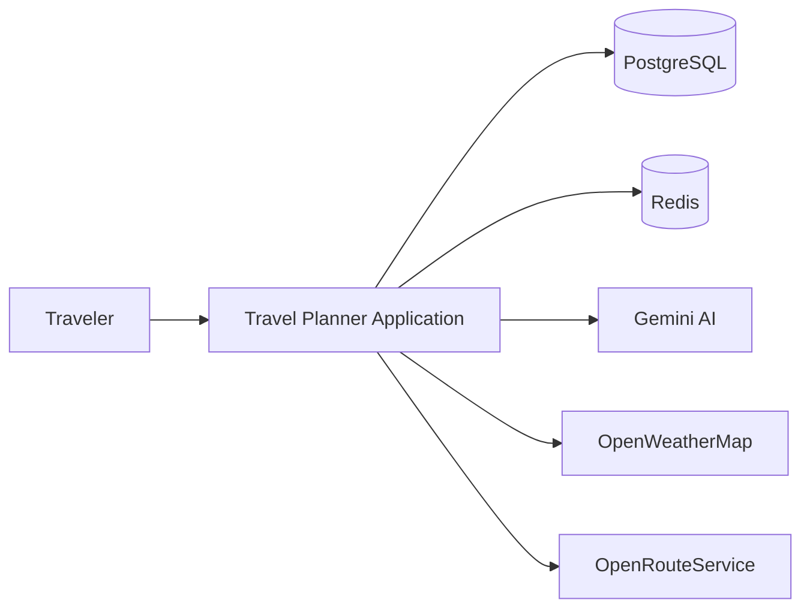
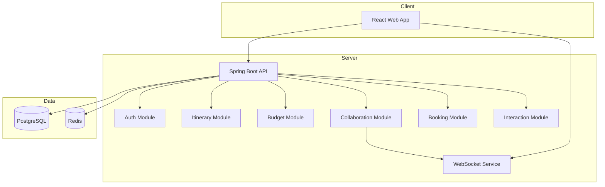

# C4 Model for Travel Planner

## Mục đích

Tài liệu này trình bày kiến trúc hệ thống theo mô hình C4, từ mức hệ thống doanh nghiệp đến mức thành phần chi tiết.

## 1. Context Diagram

## 2. Container Diagram

## 3. Component Diagram

### Backend Components

- Authentication Component
  - xử lý login, JWT, refresh token
- Itinerary Component
  - quản lý plan, destinations, route optimization
- Budget Component
  - theo dõi chi phí và thống kê
- Collaboration Component
  - đồng bộ real-time và chia sẻ chuyến đi
- Booking Component
  - tích hợp provider cho đặt chỗ
- Interaction Component
  - phản hồi người dùng và gợi ý

### Data Components

- Repository Layer
- Domain Model Layer
- Service Layer
- DTO / Mapper Layer

## 4. Code-Level Note

Tại mức code, hệ thống được tổ chức theo domain-driven structure, với các module nghiệp vụ rõ ràng và các tầng controller/service/repository. Đây là nền tảng để mở rộng theo hướng modular monolith hoặc phân tách service sau này.

## 5. Architectural Goals

- Tách biệt rõ các domain nghiệp vụ
- Tăng khả năng mở rộng và bảo trì
- Hỗ trợ real-time collaboration
- Hỗ trợ AI và dịch vụ bên ngoài
- Tạo nền tảng cho microservice hóa trong tương lai

## Tài liệu liên quan

- [Architecture Overview](architecture-overview.md)
- [System Context Diagram](system-context-diagram.md)
- [ADR Index](adr/README.md)
