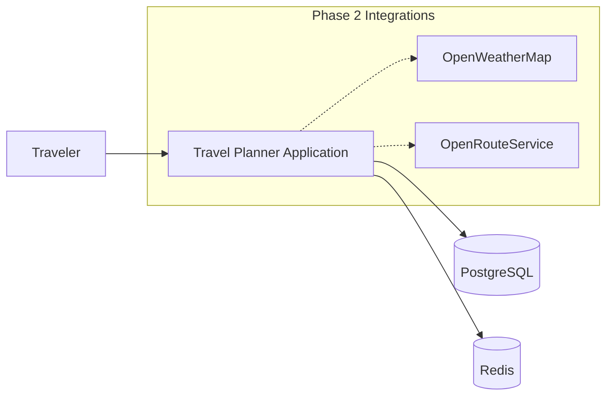
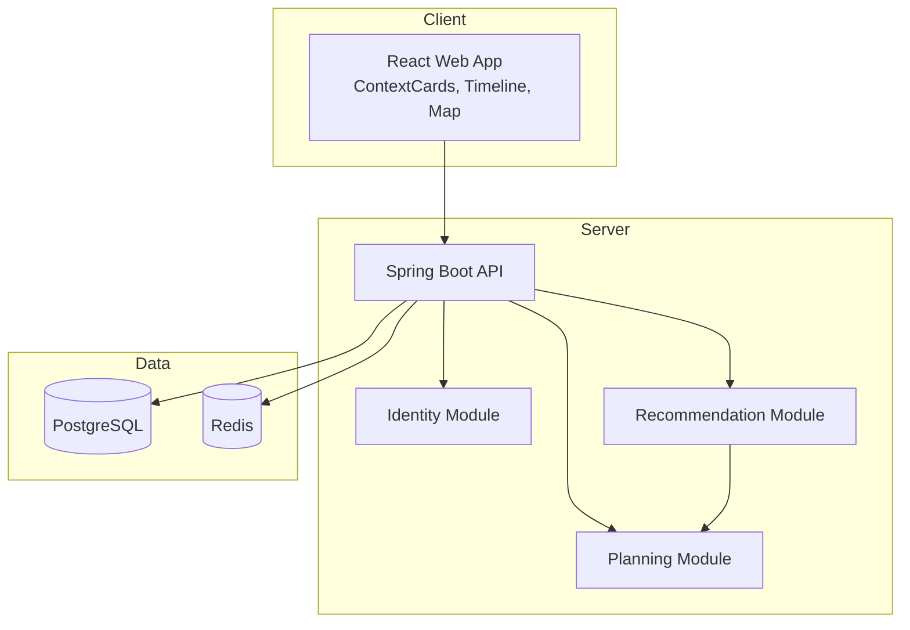
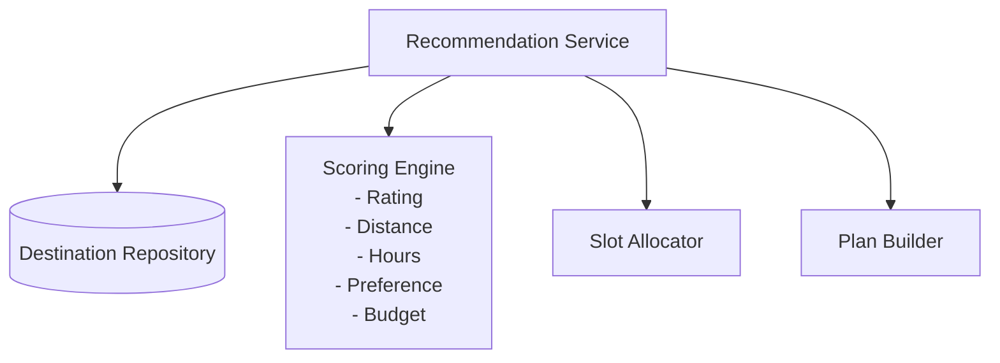

# C4 Model for Travel Planner MVP

## Mục đích

Tài liệu này trình bày kiến trúc hệ thống của Travel Planner MVP theo mô hình C4 (Context, Container, Component).

## 1. Context Diagram

```mermaid
flowchart LR
    Traveler[Traveler] --> TravelPlanner[Travel Planner Application]
    TravelPlanner --> PostgreSQL[(PostgreSQL)]
    TravelPlanner --> Redis[(Redis)]
    
    subgraph Phase 2 Integrations
        TravelPlanner -.-> Weather[OpenWeatherMap]
        TravelPlanner -.-> ORS[OpenRouteService]
    end
```

## 2. Container Diagram

```mermaid
flowchart TB
    subgraph Client
        Web[React Web App\nContextCards, Timeline, Map]
    end

    subgraph Server
        API[Spring Boot API]
        Identity[Identity Module]
        Planning[Planning Module]
        Recommendation[Recommendation Module]
    end

    subgraph Data
        PG[(PostgreSQL)]
        RD[(Redis)]
    end

    Web --> API
    API --> Identity
    API --> Planning
    API --> Recommendation
    
    Recommendation --> Planning
    
    API --> PG
    API --> RD
```

## 3. Component Diagram (Recommendation Module)

Phân tích sâu vào trái tim của hệ thống: Module `recommendation`.

```mermaid
flowchart TD
    RecommendationService[Recommendation Service]
    ScoringEngine[Scoring Engine\n- Rating\n- Distance\n- Hours\n- Preference\n- Budget]
    SlotAllocator[Slot Allocator]
    PlanBuilder[Plan Builder]
    DestRepo[(Destination Repository)]
    
    RecommendationService --> DestRepo
    RecommendationService --> ScoringEngine
    RecommendationService --> SlotAllocator
    RecommendationService --> PlanBuilder
```

## 4. Ghi chú Kiến trúc

- Hệ thống hiện tại áp dụng kiến trúc Modular Monolith tinh gọn, loại bỏ các domain phức tạp chưa cần thiết (WebSocket, Booking, Microservices) để tập trung vào giá trị cốt lõi (Core Value) là thuật toán sinh lịch trình thông minh.
- Phù hợp cho MVP Portfolio.

## Tài liệu liên quan

- [Architecture Overview](architecture-overview.md)
- [System Context Diagram](system-context-diagram.md)
