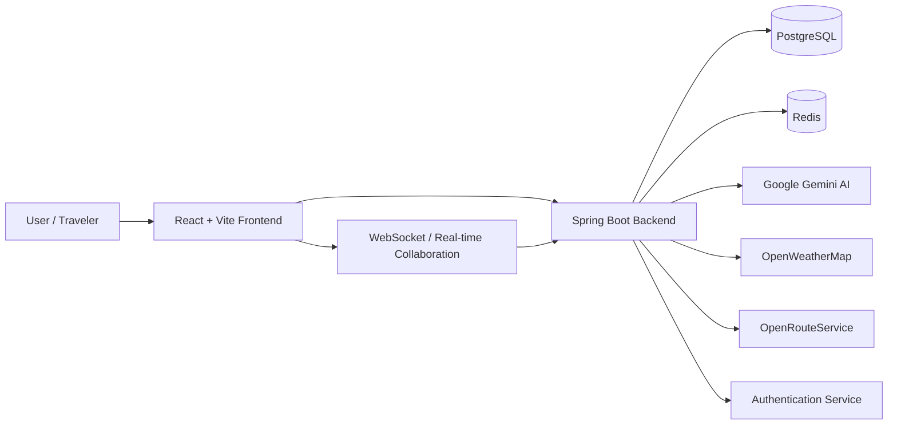

# System Context Diagram

## Mục đích

Tài liệu này mô tả bối cảnh hệ thống Travel Planner trong môi trường vận hành thực tế, bao gồm người dùng, frontend, backend, cơ sở dữ liệu, dịch vụ bên ngoài và các tương tác chính.

## Context Diagram

## Thành phần chính

### Người dùng
- Người dùng cuối sử dụng web app để lên kế hoạch du lịch
- Có thể đăng nhập, chỉnh sửa itinerary, theo dõi ngân sách và cộng tác

### Frontend
- Giao diện web hiện đại cho trải nghiệm người dùng
- Giao tiếp với backend thông qua API và WebSocket

### Backend
- Xử lý nghiệp vụ chính của hệ thống
- Quản lý authentication, itinerary, budget, collaboration, booking và interaction

### Data Stores
- PostgreSQL lưu trữ dữ liệu nghiệp vụ
- Redis hỗ trợ cache và rate limiting

### External Services
- Gemini cho AI generation và recommendation
- OpenWeatherMap cho dự báo thời tế
- OpenRouteService cho tối ưu tuyến đường

## Ghi chú

Đây là bản mô tả bối cảnh cấp cao, phù hợp cho việc hiểu tổng thể hệ thống trước khi đi sâu vào kiến trúc chi tiết hơn.

## Tài liệu liên quan

- [Architecture Overview](architecture-overview.md)
- [C4 Model](c4-model.md)
- [ADR Index](adr/README.md)
