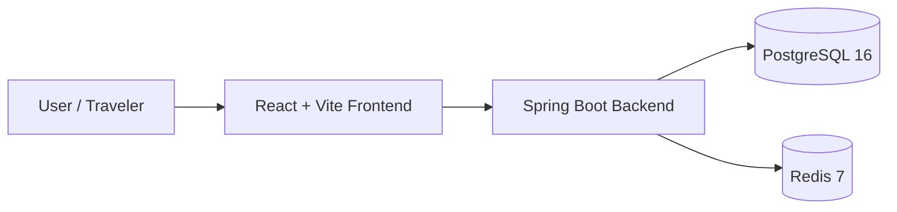

# System Context Diagram

## Mục đích

Tài liệu này mô tả bối cảnh hệ thống Travel Planner MVP trong môi trường vận hành thực tế, bao gồm người dùng, frontend, backend, cơ sở dữ liệu và các tương tác chính.

## Context Diagram

```mermaid
flowchart LR
    User[User / Traveler] --> Frontend[React + Vite Frontend]
    Frontend --> Backend[Spring Boot Backend]
    Backend --> PostgreSQL[(PostgreSQL 16)]
    Backend --> Redis[(Redis 7)]
```

## Thành phần chính

### Người dùng
- Người dùng cuối sử dụng web app để lên kế hoạch du lịch.
- Có thể đăng ký, đăng nhập và nhập bối cảnh chuyến đi thông qua UI tương tác (Context Cards).

### Frontend
- Ứng dụng React Single Page Application (SPA).
- Tích hợp bản đồ Leaflet để hiển thị trực quan các điểm đến và đường đi.
- Timeline View để hiển thị chi tiết lịch trình.

### Backend
- Spring Boot REST API.
- Cung cấp API an toàn (JWT) và chịu trách nhiệm chạy thuật toán Scoring & Slot Allocation.

### Data Stores
- **PostgreSQL**: Lưu trữ toàn bộ dữ liệu người dùng, điểm đến (Destinations) và các chuyến đi đã tạo (Trips).
- **Redis**: Phục vụ Rate Limiting (Bucket4j) để chống spam API.

## Hướng đi tiếp theo (Phase 2)
Trong giai đoạn tiếp theo, Context Diagram sẽ được mở rộng để kết nối với:
- **OpenRouteService (ORS)**: API tính toán đường đi thực tế.
- **OpenWeatherMap**: API thời tiết để tự động đổi địa điểm ngoài trời thành trong nhà khi trời mưa.

## Tài liệu liên quan

- [Architecture Overview](architecture-overview.md)
- [C4 Model](c4-model.md)
